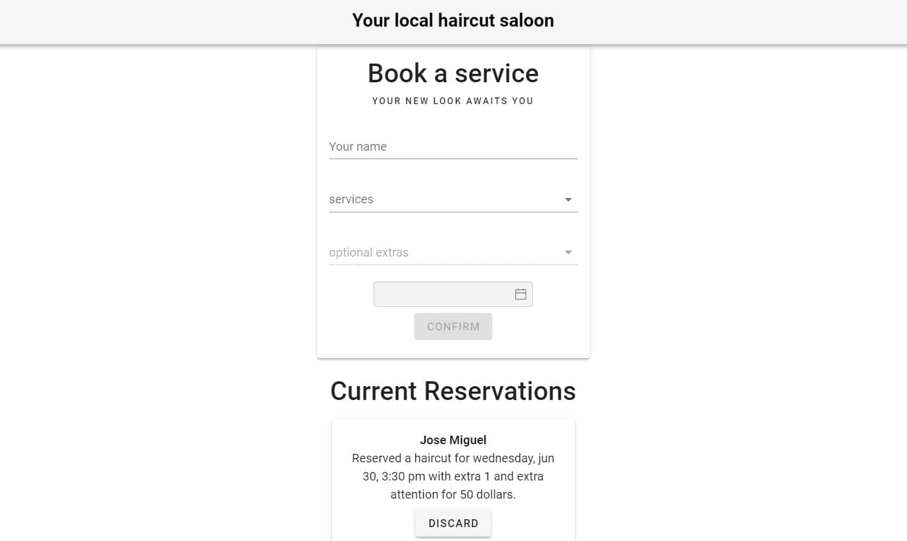

# vanidozza-prot: book a service example



This is a practice I did for myself of booking a service for a fictional hair saloon. Why? Cause I could't find anything
on the Internet, so I did it on my own.

For this project, I'm just using a fake API with the module json-server by Typicode. Install it
with

```
npm install -g json-server
```

Then you will need to create a **db.json** file with something like this:

```
{
  "services": [
    {
      "name": "Haircut",
      "price": 20,
      "step": "00:30",
      "bookings": [
        "2021-06-30T20:30:00.000Z"
      ],
      "id": 1
    }
  ],
  "extras": [
    {
      "name": "Extra 1",
      "price": 10,
      "id": 1
    },
    {
      "name": "Extra Attention",
      "price": 20,
      "id": 2
    }
  ],
  "bookings": [
    {
      "client": "Jose Miguel",
      "service": 1,
      "extras": [
        1,
        2
      ],
      "datetime": "2021-06-30T20:30:00.000Z",
      "price": 50,
      "id": 1
    }
  ]
}
```

Every service has it's own calendar, that means if you book a haircut at one hour of some date, you can
booking another service at the same time (just imagine you're two people).

Add as many services or extras as you want! Also I'm using the excellent vue2-datepicker by Mxie for
the reservation form. If you need some example for a reservation machine, well, you have it.

You're welcome.

Btw, it also works with yarn as a package manager, if you like it that way.

Important advice: this project use JSON as a server. In other words, no real database, just an example.

## Project setup
```
yarn install
```

### Compiles and hot-reloads for development
```
yarn serve
```

### Compiles and minifies for production
```
yarn build
```

### Lints and fixes files
```
yarn lint
```

### Customize configuration
See [Configuration Reference](https://cli.vuejs.org/config/).
